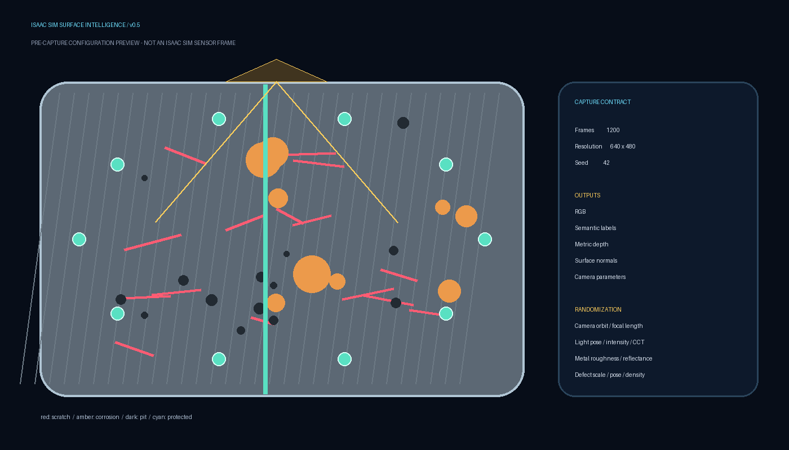
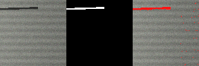
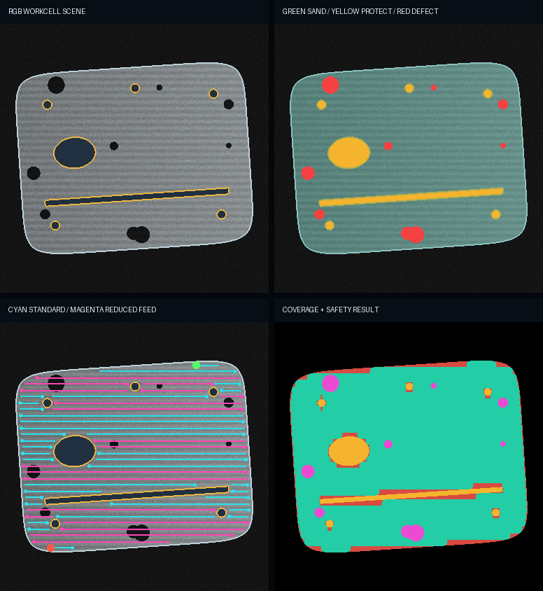
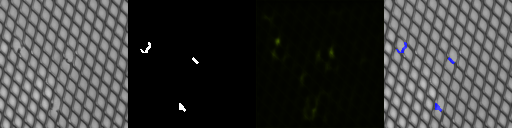
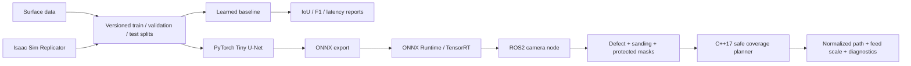

# Defect-Aware Robotic Surface Perception and Coverage

A recruiter-ready robotics project for detecting scratches, corrosion, and pitting, identifying
safe sanding regions, and converting perception masks into a protected-area-aware surface coverage
path. The repository is designed as a measured progression from a reproducible learned baseline to
PyTorch segmentation, ONNX/TensorRT deployment, ROS2 integration, and Isaac Sim synthetic-data
generation.

## Current milestone

The project now contains three measured stages. The dependency-light perception stage
generates a deterministic dataset, trains a balanced pixel-level logistic segmentation model,
tunes its decision threshold, and writes metrics, latency, previews, and a portable model. The
robotic-planning stage generates an aerospace-panel-like scene, separates sandable and protected
regions, plans a boustrophedon coverage path, reduces feed over defect regions, and verifies the
swept tool area against protected geometry. The optional PyTorch stage validates licensed MVTec AD
or custom annotated images, trains a compact U-Net, creates failure-analysis reports, exports ONNX,
and verifies numerical parity before deployment.

The MVP is deliberately dependency-light. Its score is a pipeline-validation result on synthetic
data and must not be presented as production or aircraft-surface performance. See
[`MODEL_CARD.md`](MODEL_CARD.md) for limitations.

## Isaac Sim surface digital twin (v0.5 development)

The next portfolio milestone is now implemented as a testable foundation: a versioned NVIDIA
Isaac Sim Replicator generator for an aircraft-like inspection panel. It requests aligned RGB,
semantic segmentation, distance-to-image-plane, surface normals, and camera parameters while
randomizing camera pose/focal length, lighting, metal appearance, and scratch/corrosion/pit
geometry. Fasteners and seams are labeled as protected regions for the downstream coverage
planner.

The capture contract plans 1,200 frames with deterministic 840/180/180 train/validation/test
splits. Config validation, split planning, an offline schematic, Replicator output discovery, and
incomplete-capture rejection are covered by unit tests. A real Isaac Sim render has **not yet been
executed on this development machine**, so the image below is deliberately labeled as a planning
preview rather than sensor evidence.



See [`docs/ISAAC_SIM_V05.md`](docs/ISAAC_SIM_V05.md) for the 50-frame RTX smoke-test command,
dataset schema, acceptance gates, API references, and limitations. The machine-readable planned
split is in
[`artifacts/reference/isaac_sim_v05_capture_plan.json`](artifacts/reference/isaac_sim_v05_capture_plan.json).

## Reference MVP result

The deterministic reference run completed on 120 synthetic 96 x 96 images:

| Metric | Result |
|---|---:|
| Test IoU | 0.958 |
| Test F1 / Dice | 0.978 |
| Precision | 0.961 |
| Recall | 0.996 |
| P95 model latency | 2.68 ms |

The machine-readable result is in [`artifacts/reference/metrics.json`](artifacts/reference/metrics.json).
The included preview shows RGB input, ground-truth mask, and red prediction overlay:



## Reference coverage-planning result

The deterministic 384 x 384 planning demonstration produced:

| Metric | Result |
|---|---:|
| Sandable-area coverage | 93.4% |
| Demonstration defect coverage | 100% |
| Protected-region contact | 0 pixels |
| Ordered process segments | 53 |
| Reduced-feed priority segments | 19 |



These are image-plane planning results. They are not robot trajectories until camera calibration,
surface reconstruction, motion constraints, collision checking, and controller validation are
added. See [`docs/COVERAGE_PLANNER.md`](docs/COVERAGE_PLANNER.md).

## Measured MVTec AD case study (v0.4)

The real-data pipeline has now been exercised on 1,157 licensed MVTec AD images from the `grid`,
`metal_nut`, and `screw` categories. To fit a CPU-only development machine, the measured run used a
29,921-parameter Tiny U-Net at 128 x 128 resolution. The held-out split contained 137 images.

This is explicitly a **supervised-development experiment**, not the official unsupervised MVTec AD
benchmark: anomalous images supplied in MVTec's test set were deterministically divided among
train, validation, and held-out test splits. The raw MVTec files and trained weights are excluded
from this repository and release package.

| Held-out result | Global model | Grid-specialized model |
|---|---:|---:|
| Evaluation scope | grid + metal_nut + screw | grid only |
| Test images | 137 | 33 |
| IoU | 0.286 | 0.165 |
| Dice / F1 | 0.445 | 0.283 |
| Precision | 0.314 | 0.300 |
| Recall | 0.762 | 0.268 |
| ONNX binary-mask agreement | 100% | 100% |
| ONNX Runtime CPU mean latency | 3.58 ms | 1.56 ms |
| ONNX Runtime CPU P95 latency | 14.49 ms | 3.36 ms |

The global model was dominated by `metal_nut` and produced zero IoU on the held-out grid subset.
Failure-driven category specialization recovered grid IoU from 0.000 to 0.165, including 0.364 IoU
on metal contamination and 0.250 IoU on thread defects. Thin bent, broken, and glue defects remain
unresolved. This negative result is retained because it demonstrates measurement, diagnosis, and a
targeted iteration rather than hiding failure modes.

See [`docs/MVTEC_V04_RESULTS.md`](docs/MVTEC_V04_RESULTS.md), the machine-readable
[`artifacts/reference/real_mvtec_v04.json`](artifacts/reference/real_mvtec_v04.json), and the model
card for exact protocol and limitations.



The four panels are RGB input, ground truth, probability heatmap, and prediction overlay.

## Real-data deep-learning pipeline

The training and deployment path is implemented and tested end to end. The repository
does not redistribute MVTec AD because its CC BY-NC-SA 4.0 license restricts use to
non-commercial purposes and requires accepting the official terms. Follow [`data/README.md`](data/README.md)
and [`docs/REAL_DATA_PROTOCOL.md`](docs/REAL_DATA_PROTOCOL.md).

The execution smoke test—not an accuracy benchmark—verified:

| Gate | Result |
|---|---:|
| Manifest/split validation | Pass |
| U-Net train and evaluation path | Pass |
| ONNX export | Pass |
| Maximum PyTorch/ONNX logit error | 2.38e-7 |
| Minimum binary-mask agreement | 100% |
| ONNX Runtime CPU smoke P95 at 64px | 0.77 ms |

The evidence file is [`artifacts/reference/real_pipeline_smoke.json`](artifacts/reference/real_pipeline_smoke.json).
Those fixture numbers remain separate from the v0.4 real-data evidence above.

## Architecture



## Run the MVP

From this directory:

```powershell
python -m surface_perception.cli run-all --workspace runs/mvp --config configs/mvp.json
```

Or use:

```powershell
.\scripts\run_mvp.ps1 -PythonExecutable python
```

Expected artifacts:

- `runs/mvp/dataset/`: images, masks, splits, and metadata.
- `runs/mvp/models/baseline_model.json`: portable learned baseline.
- `runs/mvp/reports/training_report.json`: loss and selected threshold.
- `runs/mvp/reports/test_report.json`: aggregate/per-image metrics and latency.
- `runs/mvp/reports/previews/`: input, ground truth, and prediction panels.

Prediction previews concatenate three views: RGB input, ground-truth mask, and prediction overlay.
Red pixels are predicted defects; blue pixels are missed defects.

## Run the robotic coverage demonstration

```powershell
python -m surface_perception.cli plan-demo --output runs/coverage_demo
```

The command creates the RGB workcell scene, four semantic/swept-area masks, a visual planning
preview, a machine-readable JSON plan, and a normalized waypoint CSV. Cyan lanes use the nominal
feed scale; magenta lanes intersect defects and use a reduced feed scale.

## Test

```powershell
python -m unittest discover -s tests -v
```

## Optional ML deployment environment

Install the optional stack when a CUDA-capable environment is available:

```powershell
python -m pip install -e ".[ml]"
```

Create a leakage-controlled manifest, train, evaluate, export, and verify:

```powershell
python -m surface_perception.cli build-manifest --mvtec-root data/mvtec_ad `
  --categories metal_nut screw grid --output runs/real_data/manifest.json
python -m surface_perception.train_real --manifest runs/real_data/manifest.json `
  --output runs/real_data/model
python -m surface_perception.evaluate_real --manifest runs/real_data/manifest.json `
  --checkpoint runs/real_data/model/best.pt --output runs/real_data/evaluation
python -m surface_perception.export_onnx --checkpoint runs/real_data/model/best.pt `
  --output runs/real_data/model/model.onnx
python -m surface_perception.onnx_parity --checkpoint runs/real_data/model/best.pt `
  --onnx runs/real_data/model/model.onnx --manifest runs/real_data/manifest.json
```

The PowerShell wrapper `scripts/run_real_pipeline.ps1` executes the complete sequence and adds an
ONNX Runtime benchmark. The manually triggered `optional-ml-smoke` GitHub Actions workflow repeats
the miniature U-Net-to-ONNX validation in a clean Linux environment without packaging its fixture
as real data.

## ROS2 packages

The ROS2 workspace contains an ONNX Runtime node that subscribes to an RGB camera, publishes a
binary mask, and reports provider, latency, and defect fraction through diagnostics.

It also contains `surface_perception_cpp`, a modern C++17 package that consumes aligned sanding,
protected-region, and defect masks. It publishes normalized image-plane path segments as groups of
`[start_x, start_y, end_x, end_y, feed_scale]` and reports planner diagnostics. A calibrated
image-to-surface transform must be supplied before commanding physical hardware.

```bash
cd ros2_ws
colcon build --symlink-install
source install/setup.bash
ros2 run surface_perception_ros surface_perception_node --ros-args \
  -p model_path:=/absolute/path/model.onnx \
  -p input_topic:=/camera/image_raw

ros2 run surface_perception_cpp coverage_planner_node
```

## Why this project maps to industrial robotics ML

- Segmentation, model training, validation, and failure analysis.
- Explicit accuracy, latency, and reproducibility evidence.
- ONNX/TensorRT-ready deployment boundary.
- ROS2 camera integration and runtime diagnostics.
- Safe coverage planning with protected-area exclusion and defect-aware feed scaling.
- A modern C++17 ROS2 planning core with unit-test foundations.
- Synthetic data and domain-randomization roadmap for Isaac Sim.
- Docker, CI, testing, model documentation, and maintainable package structure.

See [`docs/ROADMAP.md`](docs/ROADMAP.md) for the next implementation milestones.
