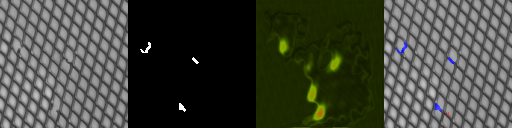

# MVTec AD v0.4 Measured Results

## Executive summary

Version 0.4 is the first measured real-image deep-learning run in this project. A compact Tiny
U-Net was trained on three MVTec AD categories, exported to ONNX, checked against PyTorch, and
benchmarked on CPU. The experiment also records a meaningful failure: a single global model did
not transfer across all selected visual domains. A category-specialized retraining recovered
performance on one failed domain.

## Protocol and data

- Dataset: MVTec AD, categories `grid`, `metal_nut`, and `screw`.
- License: CC BY-NC-SA 4.0, research/non-commercial use only.
- Total records: 1,157.
- Train: 845 images (683 good, 162 anomaly).
- Validation: 175 images (121 good, 54 anomaly).
- Held-out test: 137 images (84 good, 53 anomaly).
- Seed: 42.
- No sample IDs overlap across splits; anomaly masks are present where required.

This is a **supervised-development** protocol. MVTec AD's anomalous official test images were
deterministically divided across development splits, so these numbers must not be presented as the
official unsupervised MVTec AD benchmark. The original archive and extracted images are ignored by
Git and excluded from distributable packages.

## Global model

- Architecture: Tiny U-Net, 29,921 parameters, base width 8.
- Input: RGB, 128 x 128.
- Device: CPU.
- Completed epochs: 15.
- Selected threshold: 0.80.
- Best validation IoU: 0.271.

| Held-out metric | Result |
|---|---:|
| IoU | 0.286 |
| Dice / F1 | 0.445 |
| Precision | 0.314 |
| Recall | 0.762 |
| Pixel accuracy | 0.964 |

Per-defect review revealed that the aggregate score was dominated by `metal_nut`. The model
reached 0.869 IoU on flipped nuts and 0.201 on scratched nuts, but zero IoU on all selected grid
and screw defect groups. Pixel accuracy is not treated as sufficient evidence because defect
pixels are rare.

## Failure-driven grid specialization

The same architecture was retrained on grid images only. Its held-out grid split contains 33
images (21 good, 12 anomaly).

| Grid held-out metric | Global model | Grid-specialized model |
|---|---:|---:|
| IoU | 0.000 | 0.165 |
| Dice / F1 | 0.000 | 0.283 |
| Precision | 0.000 | 0.300 |
| Recall | 0.000 | 0.268 |

The specialized model reached 0.364 IoU on metal contamination and 0.250 IoU on thread defects.
Bent defects remained weak, while broken and glue groups remained at zero IoU. Probability maps
show a response near several broken regions but also broad texture-correlated activation, which
indicates insufficient localization and likely overfitting to periodic texture cues.

Global model failure on a held-out broken-grid image:

Grid-specialized response to the same image:

Each gallery contains RGB input, ground truth, probability heatmap, and prediction overlay from
left to right.

## Deployment verification

| Gate | Global model | Grid-specialized model |
|---|---:|---:|
| ONNX parity samples | 10 | 10 |
| Maximum absolute logit error | 1.17e-5 | 1.22e-5 |
| Minimum binary-mask agreement | 100% | 100% |
| ONNX CPU mean latency | 3.58 ms | 1.56 ms |
| ONNX CPU P95 latency | 14.49 ms | 3.36 ms |
| FPS from mean model latency | 279 | 640 |

Latency was measured with ONNX Runtime's CPUExecutionProvider at batch size one and 128 x 128.
It is model-only latency and does not include camera capture, preprocessing, postprocessing, ROS2
transport, visualization, or robot motion planning.

## What this proves and what it does not

This run proves that the repository can ingest licensed real images, enforce a deterministic data
manifest, train and evaluate segmentation models, expose category-level failures, export ONNX,
verify parity, and measure runtime. It does not prove aircraft-surface performance, safety, or
production readiness. The data are industrial texture and component images, not aircraft skins,
and the development protocol is not the official MVTec benchmark.

## Next experiment

1. Train a pretrained lightweight segmentation model and compare it with Tiny U-Net on identical
   splits and thresholds.
2. Add category-aware routing or a multi-head model to reduce cross-domain interference.
3. Repeat at 256 px on a CUDA GPU, preserving the 128 px CPU result as the baseline.
4. Build a small, permission-documented aircraft-like coupon dataset with an untouched test set.
5. Connect calibrated mask projection to the protected-area-aware ROS2 coverage planner.
