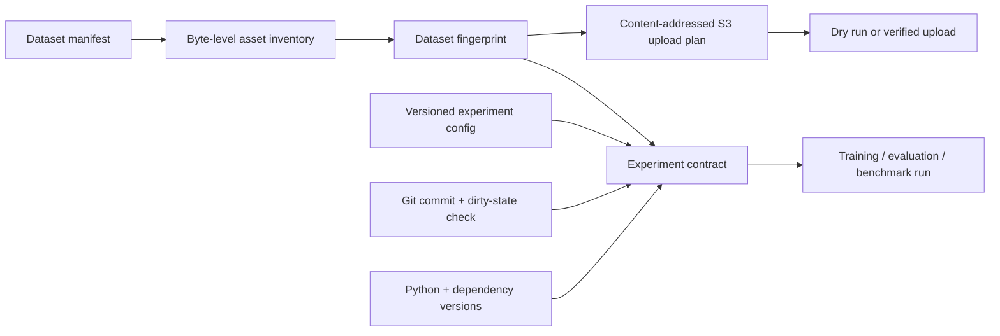

# Production ML Pipeline Contract (v0.7)

## Objective

Version 0.7 turns the research pipeline into a reproducible, container- and cloud-ready workflow.
It records which data, configuration, source revision, dependency versions, and runtime produced
an experiment. It also defines a safe, content-addressed S3-compatible upload path without
deleting remote data.

Patch 0.7.1 moves generated CI evidence into the GitHub runner's temporary directory and ignores
standard Python build metadata. A dedicated clean-tree assertion now runs immediately before
provenance capture, preserving the production requirement instead of bypassing it with a dirty
development contract.

This milestone targets Temple Allen requirements around maintainable software, large-dataset
organization, containerized ML workflows, cloud-connected storage, automation, testing, and
documentation. It does not claim that a real cloud upload or cloud GPU training job has been run.

## Reproducibility chain



## Dataset inventory

The inventory command reads a real-data or validated Isaac Sim manifest, verifies every referenced
asset, and records:

- unique sample ID, split, category, defect type, and anomaly flag;
- asset label, file name, byte size, and SHA-256;
- sample/asset totals and split/category counts;
- a canonical dataset fingerprint independent of absolute local paths.

```powershell
python -m surface_perception.cli inventory `
  --manifest runs/real_data/manifest.json `
  --output runs/production-contract/dataset_inventory.json

python -m surface_perception.cli verify-inventory `
  --manifest runs/real_data/manifest.json `
  --inventory runs/production-contract/dataset_inventory.json
```

Relocation from Windows to Docker/Linux is accepted only when semantic records and every asset hash
still match. The original manifest-byte hash is reported separately so an operator can see that
the path-bearing source file changed.

## Experiment contract

[`configs/production_experiment_v07.json`](../configs/production_experiment_v07.json) versions the
task, data roles, architecture, deployment formats, benchmark protocol, acceptance gates, and
cloud policy. The contract adds:

- dataset and config fingerprints;
- Git commit, branch, tracked-diff fingerprint, and untracked-file list;
- Python/platform information and dependency versions;
- a single reproducibility fingerprint for the complete identity.

Production capture requires a source commit and clean Git state. `--allow-dirty` exists only for
explicit development snapshots, and the dirty state is retained in the contract.

```powershell
.\scripts\run_production_contract.ps1 `
  -Manifest "runs/real_data/manifest.json" `
  -OutputDirectory "runs/production-contract"
```

## S3-compatible storage

The cloud command verifies the inventory before planning any object. Object keys include the
dataset fingerprint and therefore cannot silently overwrite a different dataset version.

```text
surface-perception/datasets/<fingerprint>/<split>/<sample-id>/<asset>.<extension>
```

The default is a non-mutating dry run:

```powershell
python -m surface_perception.cloud_sync `
  --manifest runs/real_data/manifest.json `
  --inventory runs/production-contract/dataset_inventory.json `
  --bucket YOUR_BUCKET `
  --prefix surface-perception/aircraft-surfaces `
  --sse AES256 `
  --plan-output runs/production-contract/s3_upload_plan.json
```

For a private S3-compatible service, add an HTTPS endpoint such as
`--endpoint-url https://objects.example.internal`. Endpoint credentials, query parameters, and
unencrypted HTTP endpoints are rejected; credentials must come from the runtime environment.

Add `--execute` only after reviewing the plan and configuring credentials outside the repository.
The implementation:

- re-hashes every local asset immediately before upload;
- skips objects whose stored SHA-256 metadata already matches;
- uploads a changed or missing object with dataset/hash metadata;
- supports S3-managed AES-256 or KMS encryption requests;
- supports explicit HTTPS endpoints for private S3-compatible storage;
- exposes no object-deletion or bucket-deletion operation;
- refuses to treat authorization failures as missing objects.

The plan written to disk excludes absolute local paths. AWS credentials, bucket policies, KMS
keys, lifecycle rules, network security, cost controls, and data-classification approval remain
deployment-owner responsibilities.

## Docker and Compose

The multi-stage [`Dockerfile`](../Dockerfile) contains:

- `runtime`: dependency-light MVP execution;
- `ml`: optional PyTorch/ONNX training and deployment stack;
- `ci`: tests and smoke utilities.

All stages use a non-root user. Compose runs with a read-only root filesystem, `/tmp` as temporary
memory, explicit read-only input mounts, and a writable output mount. The source commit and branch
can be supplied as build arguments for provenance when `.git` is excluded from the image.

```powershell
$env:SOURCE_COMMIT = git rev-parse HEAD
$env:SOURCE_BRANCH = git branch --show-current
docker compose run --rm tests
docker compose run --rm mvp
docker compose --profile ml run --rm ml
```

Docker was not installed on the development laptop used for this implementation. The image-build
and read-only container smoke tests are therefore delegated to
[`production-pipeline.yml`](../.github/workflows/production-pipeline.yml) on GitHub-hosted Linux
runners. Do not claim a local container result until it has actually run.

## CI evidence

The production workflow performs two independent jobs:

1. creates a deterministic 42-sample fixture, builds/verifies an inventory, captures a clean-code
   experiment contract, generates a dry-run upload plan, and publishes those files as a workflow
   artifact;
2. builds the `ci` and `runtime` container targets and runs them with read-only filesystems.

The fixture validates the pipeline implementation only. It is not accuracy evidence, real
aircraft data, cloud training, or production deployment.

## Next deployment gates

1. Commit and push v0.7, then require both production workflow jobs to pass.
2. Configure a private test bucket with least-privilege upload/read access and lifecycle policy.
3. Perform an explicit upload to the test prefix and verify idempotent second execution.
4. Add a cloud GPU runner for 256 px training with instance type, cost, duration, and utilization.
5. Execute Isaac Sim and TensorRT work on the RTX target, keeping dataset/experiment contracts.
6. Add post-deployment drift/failure monitoring against system-level EMMA requirements.
