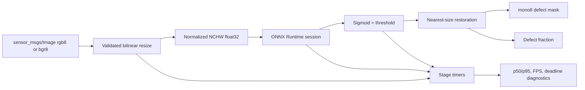

# ROS2 Real-Time Surface Perception — v0.8 Development

## Objective

Version 0.8 moves the segmentation path from a Python prototype toward a testable C++17 ROS2
deployment. This development slice implements the deterministic transformation and telemetry
contracts plus an optional ONNX Runtime node. It does not yet claim a successful native build,
camera run, rosbag replay, or target-hardware deadline result.

## Runtime flow



## Model and image contract

- One float32 model input with shape `[1, 3, H, W]`; dynamic dimensions are accepted when the
  configured height and width determine each frame.
- One float32 output with runtime shape `[1, 1, H, W]`.
- Camera messages must use `rgb8` or `bgr8` and provide a valid `step` and backing buffer.
- Inputs are resized bilinearly, converted to RGB NCHW, and normalized to `[0, 1]`.
- Logits use a numerically stable sigmoid and configured threshold in `[0, 1]`.
- Masks are restored to the source frame with nearest-neighbor sampling and published as `mono8`.

Every shape, encoding, buffer-size, threshold, model-path, timing-window, and deadline parameter is
validated. Frame-level exceptions increment a failure counter and publish an error diagnostic.

## Outputs

| Topic | Type | Meaning |
|---|---|---|
| `/surface_perception/mask` | `sensor_msgs/msg/Image` | Binary `mono8` mask aligned to input size |
| `/surface_perception/defect_fraction` | `std_msgs/msg/Float32` | Fraction of positive output pixels |
| `/surface_perception/diagnostics` | `diagnostic_msgs/msg/DiagnosticArray` | Provider, stage timing, p50/p95, FPS, confidence, failures |

The diagnostic state becomes `WARN` when rolling p95 end-to-end processing exceeds
`maximum_p95_ms`. This is an application-level processing deadline, not a proof of hard real-time
behavior or end-to-end camera-to-actuator latency.

## Build the dependency-light core

Use Ubuntu 22.04 with ROS2 Humble:

```bash
source /opt/ros/humble/setup.bash
cd ros2_ws
colcon build --packages-select surface_perception_cpp \
  --cmake-args -DSURFACE_PERCEPTION_ENABLE_ONNX=OFF -DCMAKE_BUILD_TYPE=Release
colcon test --packages-select surface_perception_cpp --event-handlers console_direct+
colcon test-result --verbose
```

The [`ros2-realtime-v08` GitHub workflow](https://github.com/DEWARAJ/defect-aware-robotic-surface-system/actions/runs/31644290894)
passed this contract in a ROS2 Humble container at source commit `6826a0c`. It built the package in
Release mode, passed both CTest executables, passed seven GoogleTest cases, and reported nine total
checks with zero errors, failures, or skips. It does not build the optional ONNX node.

## Build the native ONNX node

The [native CI contract](https://github.com/DEWARAJ/defect-aware-robotic-surface-system/actions/runs/31644763535)
passed against the official ONNX Runtime `1.29.0` Linux x64 CPU SDK after verifying its published
SHA-256 digest. It compiled and linked `realtime_inference_node`, verified the executable, and
passed all C++ tests. For a local build, point `ONNXRUNTIME_ROOT` at an equivalent extracted root
containing headers and the runtime library:

```bash
export ONNXRUNTIME_ROOT=/opt/onnxruntime
colcon build --packages-select surface_perception_cpp \
  --cmake-args -DSURFACE_PERCEPTION_ENABLE_ONNX=ON -DCMAKE_BUILD_TYPE=Release
source install/setup.bash
ros2 launch surface_perception_cpp realtime_inference.launch.py \
  model_path:=/absolute/path/model.onnx
```

ONNX Runtime's C++ API is a thin wrapper over its C API and supports session input/output name
allocation and synchronous `Run`. The node uses those lifetime-managed C++ wrappers.

## Parameters

| Parameter | Default | Safety rule |
|---|---:|---|
| `model_path` | `model.onnx` | Must be an existing regular file |
| `input_topic` | `/camera/image_raw` | Sensor-data QoS subscription |
| `mask_topic` | `/surface_perception/mask` | Published `mono8` mask |
| `input_width` / `input_height` | `256` | Positive and model-compatible |
| `threshold` | `0.5` | Finite value in `[0, 1]` |
| `telemetry_window` | `120` | Positive rolling sample count |
| `maximum_p95_ms` | `50.0` | Positive warning threshold |
| `intra_op_threads` | `1` | Positive CPU thread count |

## Evidence gates before calling v0.8 complete

1. Replay a versioned rosbag with expected mask hashes and message counts.
2. Record preprocessing, inference, postprocessing, end-to-end p50/p95/p99, FPS, CPU, and memory.
3. Repeat on the intended NVIDIA/edge target and compare FP32, FP16, and INT8 artifacts.
4. Test malformed images, dropped frames, slow inference, model mismatch, and node restart behavior.
5. Connect the mask topic to the protected-region-aware C++ coverage planner.

The current Windows development machine has no ROS2 compiler toolchain, `colcon`, native ONNX
Runtime SDK, camera, or target GPU. Linux ROS2 compilation and dependency-light C++ tests are now
verified by GitHub Actions; native ONNX execution, rosbag replay, and hardware performance remain
unclaimed evidence gates.
